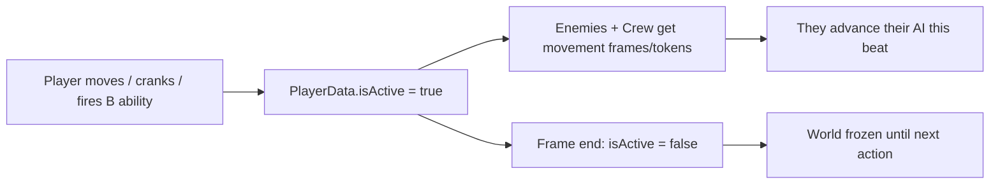
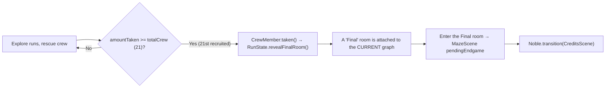
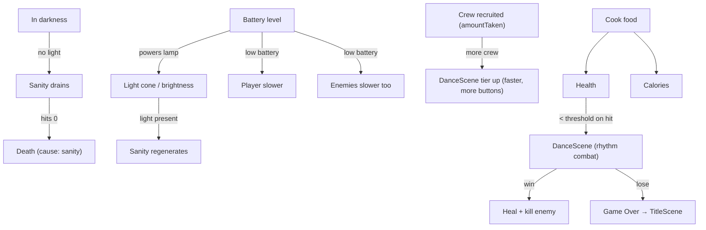
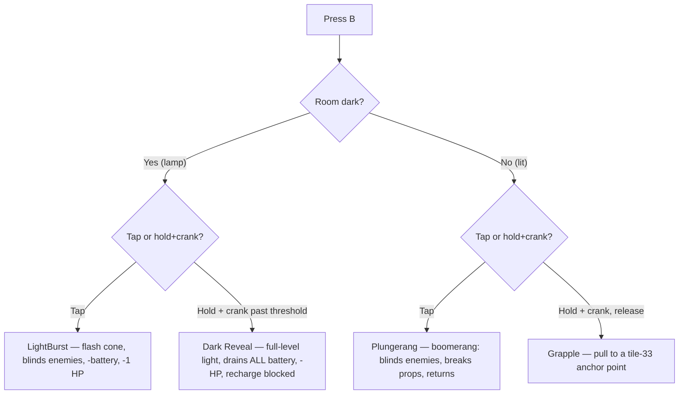
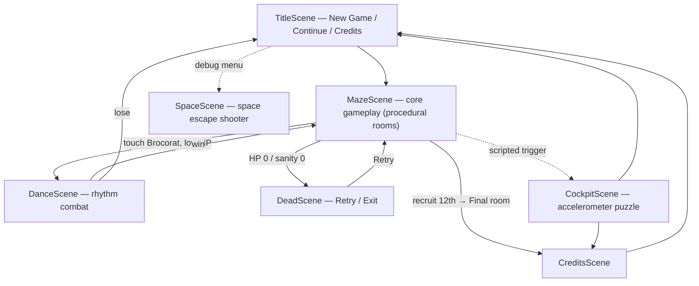

# Game Overview — Mechanics, Abilities & How They Connect

A single high-level map of *DinoPirates from Inner Space: Brocolation* — what the game is,
how its systems feed each other, the full ability/item roster, and how a playthrough is
"finished". For deep detail on any system, follow the links to the focused docs.

> This is the connective-tissue document. Each section links to the authoritative deep dive.

---

## 1. Premise & core fantasy

You are a dino-pirate exploring the dark, shifting insides of a creature/ship, **rescuing your
scattered crew** one by one. The world is a **roguelike**: every run is a freshly generated
graph of rooms. You get stronger permanently (items, skills, recruited crew persist), but a
single run ends only when you die — or when you rescue the **last** crew member and step into
the final room.

Platform: Panic Playdate (400×240, 1-bit, Lua + Noble Engine).

---

## 2. The core loop — "time moves when you move"

The single most important rule that ties every system together:

> **The world is turn-based and player-driven.** Enemies and crew only advance their AI when
> the player *acts*. Standing still freezes the world.

- Each successful `Player:move()` sets `PlayerData.isActive = true` and hands out
  **movement frames** (3) to every enemy/crew in the room.
- Cranking the **battery** also pulses `isActive` — so you can let the world move without
  walking.
- Firing a **B ability** (flash / plungerang / grapple / dark reveal) hands out **movement
  tokens** (5) instead.
- At the end of the frame `isActive` resets to `false`.

This is why battery, sanity, positioning and combat all revolve around *when* you choose to
move. See [PLAYER_SYSTEMS.md §10](PLAYER_SYSTEMS.md) and [ENEMIES_AND_COMBAT.md](ENEMIES_AND_COMBAT.md).

---

## 3. Run structure & meta-progression

There are **no fixed levels**. You play **runs**; each run is a procedurally generated room
graph. Full detail in [PROCEDURAL_GENERATION.md](PROCEDURAL_GENERATION.md).

| Concept | Meaning |
|---|---|
| **Run** | One generated graph, played until death (or victory). |
| **Meta-progression** | `amountTaken` (crew recruited), items, skills, seen cutscenes, `runCount` — all **persist** across runs. Wiped only by deleting the save. |
| **Run size scaling** | New graphs use `roomsBase (8) + amountTaken`, capped at `roomsMax (20)`. More crew rescued ⇒ bigger, richer runs. |
| **Pool filtering** | Rooms are re-filtered against your current items/skills, so progress unlocks previously unreachable rooms. |

A **new graph is generated only** on: New Game, Death→Retry, falling through a hole
(`startRun("startdown")`), or rising through a tube (`startRun("startup")`). Recruiting crew
mid-run does **not** rebuild the graph.

---

## 4. How you "finish" the game (win condition)

- The **only** win condition is recruiting the **entire crew roster**: `Config.MapGen.totalCrew = 21` (subject to further tuning upward).
- Recruiting the last one (`CrewMember:taken()`) calls `RunState.revealFinalRoom()`, which
  **attaches** a `roomRole = "final"` room onto the current graph (no regeneration).
- Entering that room sets `MazeScene.pendingEndgame`; on transition completion it runs
  `Noble.transition(CreditsScene)`.
- The **CreditsScene** is the current stand-in for the authored ending sequence (see the code
  comment in `MazeScene:start()` — "swap CreditsScene for the real ending scene when authored").

Crew count never gates a "next level" — there is no level step. To advance you simply keep
playing; to *win* you complete the roster.

---

## 5. The four survival resources (and how they interlock)

Four numbers on `PlayerData` drive tension. They are deeply coupled — the clever bit is that
**battery is the hub**. Full detail in [PLAYER_SYSTEMS.md](PLAYER_SYSTEMS.md).

| Resource | Default / Cap | Drops when… | Rises when… |
|---|---|---|---|
| **Health (HP)** | 3 / 10 | Touched by a Brocorat; Dark Reveal & LightBurst self-damage | Win a DanceScene; cook food at a microwave |
| **Battery** | 0–100 | Moving in the dark, crossing holes, LightBurst cost | Crank it; item pickups fill it to 100 |
| **Sanity** | 0–max | Being in darkness (worse with no lamp / low battery) | Standing in light, or lamp + high battery |
| **Calories** | — / 500 | Walking (pedometer burns every 200 steps) | Cook food; win a DanceScene |

### How they feed each other

Key emergent tensions:

- **Light is life, but light costs battery.** No lamp = you *cannot* recover sanity in the dark
  at all; light is the only cure.
- **Low battery is a double-edged slowdown**: you move slower, but so do enemies — a desperate
  resource, not a pure penalty.
- **Sanity hitting 0 is fatal** (and increments `sanityCounter`, which gates the "no repeated
  room" rule and is a lifetime stat).
- **Progress raises the stakes**: DanceScene difficulty scales with **crew recruited**
  (`amountTaken`) — the more of your roster you've saved, the tougher (and eventually
  different-looking) the enemies become. See §9.

---

## 6. Items & Skills

Items are physical pickups; skills are the verbs they unlock. Many pickups grant both. State
lives in `PlayerData.items` / `PlayerData.skills`; pickup logic in `entities/player/items.lua`.

| Item | Grants skill | Unlocks |
|---|---|---|
| **Lamp** (`hasLamp`) | `canFlash` | See in darkness; **LightBurst**; enables sanity recovery in the dark |
| **Plunger** (`hasPlunger`) | `canPlungerang` | **Plungerang** boomerang; also grants **slime immunity** |
| **Radio** (`hasRadio`) | — | Dialog / video-feed interactions |
| **DWatch** (`hasDWatch`) | — | (pedometer/utility flag) |
| **Notes** (`hasNotes`) | routes granted skills | "Notes" pickups can grant skills via `grabNotes` |
| **Keys** (`keys[n]`) | — | Open locked doors (see [DOORS_AND_KEYS.md](DOORS_AND_KEYS.md)) |
| **Food** | — | Consumed at a microwave to heal (see [MICROWAVE_AND_FOOD.md](MICROWAVE_AND_FOOD.md)) |

Skill flags: `canDance`, `canFlash`, `canPlungerang`, `canCrossSlime`, `canGrapple`,
`canFight`. `itemGift` / `notes` grants are parsed from `"key:value"` strings and routed to the
correct table automatically.

---

## 7. Abilities — the B button is context-sensitive

The **B button** routes to a different ability depending on **light vs darkness** and **tap vs
hold-and-crank**. This is the heart of the moment-to-moment toolkit (`abilities.lua`,
`lightburst.lua`, `plunge.lua`, `grapple.lua`).

| Ability | Where | Trigger | Effect | Cost |
|---|---|---|---|---|
| **LightBurst** | Darkness | Tap B (facing a direction) | Cone flash; blinds enemies/crew for 60 frames | −10 battery, −1 HP, 1s cooldown |
| **Dark Reveal** | Darkness | Hold B + crank past threshold | Lights the whole level briefly | Drains all battery, −HP, recharge blocked after |
| **Plungerang** | Lit room | Tap B (facing a direction) | Throwing boomerang; blinds enemies, **smashes destructible boxes**, bounces off props, returns to hand | Blocked while tiny; one at a time |
| **Grapple** | Lit room | Hold B + crank, release | Charged plungerang pulls player to a grapple anchor (IntGrid tile 33) | Requires `canGrapple`; see [GRAPPLING_HOOK.md](GRAPPLING_HOOK.md) |

Both lethal-cost abilities (LightBurst, Dark Reveal) **refuse to fire** if the self-damage
would drop you into combat/death — the cost is always real and ignores invincibility.

### Dash — the D-pad ability

Separate from the B toolkit, the **Dash** is triggered by **double-tapping a D-pad direction**
(`dash.lua`, `Config.Dash`).

| Property | Value |
|---|---|
| Trigger | Double-tap a direction (tap window `250 ms`) |
| Distance / speed | `56 px` at `6 px/frame` |
| Cooldown | `500 ms` |
| On hitting a **destructible box** | **Smashes it** (`smash()`), then bounces back `16 px` |
| On hitting any other solid | Bounces back `16 px`, dash ends |
| Restrictions | Not available while **tiny** or while standing on a **hole** |
| Hazard commit | If the dash *lands* on a hole/slime it falls/slides immediately (bypasses the grace period) |

So **both the Plungerang and the Dash break boxes** — the plungerang at range, the dash on
contact.

---

## 8. Movement & the environment

Movement is more than walking — the floor itself is a mechanic (`movement.lua`, `sliding.lua`,
`hole.lua`, `state.lua`).

- **Slime tiles** — you auto-slide (speed 4) until you hit a wall or leave the slime. The
  **Plunger grants immunity** (or the `canCrossSlime` skill).
- **Holes** — you fall through (after a short grace) → starts a *new run* at a `StartDown`
  room (it doesn't kill you). **Tiny holes** (IntGrid 32) only affect the **tiny** player.
- **Pneumatic tubes** — only the **tiny** player can rise through them, starting a new run at a
  `StartUp` room.
- **Tiny / big transformation** — the **minifier** prop (crank) shrinks/grows you. Tiny =
  smaller hitbox, cheaper hole crossings, access to tiny-holes/tubes, but **no Plungerang and no
  cooking**.
- **Doors, keys, portals** — doors connect graph edges; wall-plugs cover unconnected sides;
  portals are secret/vertical exits ([DOORS_AND_KEYS.md](DOORS_AND_KEYS.md),
  [LEVEL_LOADING.md](LEVEL_LOADING.md)).
- **Dash** (double-tap a direction) is a movement burst that smashes boxes and bounces off
  walls — see §7. It commits you: dashing onto a hole/slime triggers the fall/slide.

---

## 9. Enemies & combat (DanceScene)

- **Brocorat** is the standard enemy; AI modes: `search`, `blindSearch`, `linealSearch`, plus
  `sonar`/`blind` states. Enemies only move on your beats (turn-based). Their speed scales with
  your **battery** and darkness ([ENEMIES_AND_COMBAT.md](ENEMIES_AND_COMBAT.md)).
- **Touching a Brocorat**: you take damage; if HP would fall below the dance threshold you enter
  **DanceScene**; otherwise you just get knockback + brief invincibility.
- **DanceScene** is **rhythm combat**: press buttons in time to push a balance bar into the win
  zone. **Win** → kill the enemy, heal HP, +calories, return to the dungeon. **Lose** → Game
  Over (→ TitleScene). Difficulty is **deterministic and scales with crew recruited**
  (`amountTaken`): four tiers (`basic`/`evolve`/`badass`/`boss`) with higher BPM, more buttons,
  and their own enemy spritesheet ([DANCE_SCENE.md](DANCE_SCENE.md)).

---

## 10. Crew members (the objective)

- **CrewMembers** are friendly NPCs with hiding/capture AI. When cornered (too many bounces)
  they **hide**; you flush them out and catch them.
- Recruiting one (`CrewMember:taken()`) sets `amountTaken += 1`, marks the node cleared so they
  don't respawn this run, and returns your plungerang to hand.
- Recruiting the **12th** triggers the endgame (§4). See
  [CREWMEMBER_AND_COLLISIONS.md](CREWMEMBER_AND_COLLISIONS.md).

---

## 11. Death & vertical navigation

| Event | Result |
|---|---|
| Lose a DanceScene | `dead("hp")` → **DeadScene** (Retry starts a fresh run; meta persists) |
| Sanity hits 0 in the dark | `dead("sanity")` → **DeadScene** |
| Fall through a full hole | **Not death** — new run at a `StartDown` room |
| Rise through a tube (tiny) | **Not death** — new run at a `StartUp` room |

Retry from DeadScene regenerates the graph and bumps `runCount`; there is no "reload the room
you died in".

---

## 12. Scenes & the overall flow

| Scene | Role |
|---|---|
| **TitleScene** | Menu: New Game / Continue / Credits (+ debug entries) ([TITLE_SCENE.md](TITLE_SCENE.md)) |
| **MazeScene** | The core dungeon loop — loads procedural rooms, spawns everything |
| **DanceScene** | Rhythm combat on enemy contact |
| **DeadScene** | Game over; Retry = fresh run |
| **CockpitScene** | Accelerometer + D-pad sequence puzzle; a scripted set-piece reachable in-game via a trigger (`TRIGGER_SCENES.Cockpit`), leading to Credits or Title ([COCKPIT_SCENE.md](COCKPIT_SCENE.md)) |
| **SpaceScene** | Crank-toggled space-escape shooter (currently a debug-menu entry) ([SPACE_SCENE.md](SPACE_SCENE.md)) |
| **CreditsScene** | Scrolling credits — the current endgame payoff ([CREDITS_SCENE.md](CREDITS_SCENE.md)) |

---

## 13. One-paragraph summary

You explore procedurally generated runs in the dark, managing **battery** (the hub resource
that powers your lamp and gates your speed), **sanity** (which only light restores and whose
collapse is fatal), **health** (restored by winning rhythm fights or cooking food), and
**calories**. The world only moves when you do. Your **lamp** and **plunger** unlock a
context-sensitive **B** toolkit — LightBurst/Dark Reveal in darkness, Plungerang/Grapple in
light. The goal is to **rescue the entire crew roster** (`Config.MapGen.totalCrew`, currently 21); recruiting the last one opens the
**Final room**, and stepping into it rolls the credits. Combat difficulty rises with the
crew you've rescued, so the deeper you get into the roster the tougher the fights. Death (from
combat or lost sanity) just starts a bigger new run — your crew, items and skills carry forward.

---

## Deep-dive index

- [PLAYER_SYSTEMS.md](PLAYER_SYSTEMS.md) — movement, battery, sanity, health, calories, transformation, abilities, animation
- [PROCEDURAL_GENERATION.md](PROCEDURAL_GENERATION.md) — run graph, pool, scaling, victory
- [ENEMIES_AND_COMBAT.md](ENEMIES_AND_COMBAT.md) / [DANCE_SCENE.md](DANCE_SCENE.md) — AI & rhythm combat
- [CREWMEMBER_AND_COLLISIONS.md](CREWMEMBER_AND_COLLISIONS.md) — crew AI & recruitment
- [GRAPPLING_HOOK.md](GRAPPLING_HOOK.md) / [PLUNGERANG.md](PLUNGERANG.md) — projectile & grapple
- [MICROWAVE_AND_FOOD.md](MICROWAVE_AND_FOOD.md) — healing loop
- [DOORS_AND_KEYS.md](DOORS_AND_KEYS.md) / [LEVEL_LOADING.md](LEVEL_LOADING.md) / [TILE_LOADING.md](TILE_LOADING.md) — rooms & traversal
- [TRIGGER_SYSTEM.md](TRIGGER_SYSTEM.md) / [DIALOG_SYSTEM.md](DIALOG_SYSTEM.md) / [CUTSCENE_SYSTEM.md](CUTSCENE_SYSTEM.md) — scripted content
- [SAVE_SYSTEM.md](SAVE_SYSTEM.md) — persistence
- [HUD_SYSTEM.md](HUD_SYSTEM.md) / [INGAME_MENU.md](INGAME_MENU.md) — UI
- [ACHIEVEMENTS.md](ACHIEVEMENTS.md) — achievements
- [ARCHITECTURE.md](ARCHITECTURE.md) / [DATA_FLOW.md](DATA_FLOW.md) — engine & data
